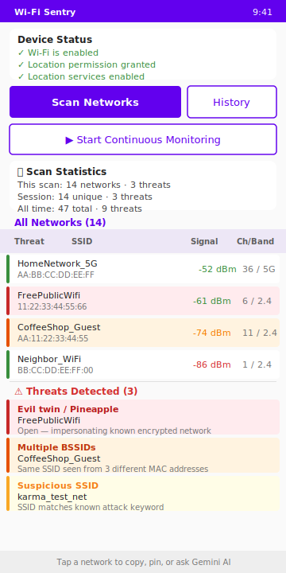

<div align="center">
  
  <h1>Wi-Fi Sentry</h1>
  <p>Real-time Wi-Fi threat detection — on Android, Windows, or any browser.</p>
</div>

## 📥 Download

**[⬇️ Latest Release — GitHub Releases page](https://github.com/dvntone/wifisentry/releases/latest)**

| Platform | Artifact | Server required? |
|---|---|---|
| **Android APK** (native) | `app-dev-release.apk` | ❌ No — fully on-device |
| Windows Desktop (Electron x64) | `.exe` installer | ❌ No — bundled |
| Web PWA | `.tar.gz` / `.zip` | ✅ Yes — `npm start` |

> See [CHANGES.md](./CHANGES.md) for a full changelog.

---

## 📱 Android app



The Android APK is a **fully native app** — no Node.js, no npm, no extra tools, no internet connection required. All scanning and threat analysis runs on-device using Android's built-in `WifiManager`.

**Quick install:**
1. Download `app-dev-release.apk` from the [Releases page](https://github.com/dvntone/wifisentry/releases/latest)
2. Enable **Install from unknown sources** in Android Settings
3. Install and open **Wi-Fi Sentry**
4. Grant location permission when prompted
5. Tap **Scan Networks**

See [`android-native/README.md`](./android-native/README.md) for the full feature list and build instructions.

<br clear="right"/>

---

## ✨ Features

- **15 on-device threat heuristics** — Karma, evil twin, Wi-Fi Pineapple, MAC spoofing, beacon flood, BSSID near-clone, and more
- **Live dual-panel UI** — All networks and flagged threats side-by-side with sortable columns
- **Continuous monitoring** — Background scanning with OS notifications
- **Scan history & export** — CSV, plain text, WiGLE CSV v1.4, and m8b formats
- **AP change analysis** — Detects access-point moves, band shifts, and rogue insertions across scan history
- **Gemini AI integration** — Tap any flagged network to get an AI-powered threat assessment (free API key, on-device only)
- **WiGLE import** — Seed your local threat database from existing wardriving data
- **Web PWA / Electron desktop** — Node.js backend with Next.js dashboard for desktop or browser use

## 🏗️ Architecture

| | Android (native) | Web / Desktop |
|---|---|---|
| Runtime | On-device (no server) | Node.js backend + Next.js frontend |
| Scanning | Android `WifiManager` | `node-wifi` (`iw` / `iwlist`) |
| Threat engine | Kotlin `ThreatAnalyzer` | JavaScript heuristics |
| Storage | JSON in app storage | Firebase / SQLite |
| AI | Gemini (on-device key) | Gemini API |

## 🚀 Web / Desktop Quick Start

```bash
# 1. Install dependencies
npm install

# 2. Configure environment (optional — copy and edit)
cp .env.example .env

# 3. Start backend
npm start

# 4. Start frontend (new terminal)
cd web-app && npm run dev
```

Dashboard at **http://localhost:3000**. See [INSTALLATION.md](./INSTALLATION.md) for full prerequisites and troubleshooting.

## 🚦 Roadmap

- [x] Native Android APK — no server required
- [x] Gemini AI per-network threat assessment
- [x] WiGLE import / export
- [ ] Bluetooth threat detection
- [ ] Real-time WebSocket alerts
- [ ] Machine learning threat classification
- [ ] 5G network analysis

## 📄 License & Contributing

MIT — see [LICENSE](./LICENSE).

Contributions welcome: fork → feature branch → PR.

For bugs or questions open a [GitHub Issue](https://github.com/dvntone/wifisentry/issues).
